<p align="center">
  
</p>

[](https://www.python.org)
[](https://www.gtk.org)
[](https://github.com/google-ai-edge/LiteRT-LM)
[](https://ubuntu.com)
[]()
[]()
[]()
[]()
[]()
[]()
[]()

## Box for Linux (Desktop)

**Box for Linux** is a native GTK4 / libadwaita desktop app that brings the Box
experience to the Linux desktop — fully offline local chat, real-time voice
conversation, live camera vision, document Q&A, and web/file tools, all running
on your own machine. Built on Google's LiteRT-LM runtime, it shares the
philosophy of the Android app — on-device, offline-first AI, no account, no
telemetry — in an app designed from the ground up for the Linux desktop.

> [!IMPORTANT]
> Box for Linux is a **separate application, written from scratch** — it is
> **not** a port, build, or fork of the Android app. The two share a name, a
> philosophy, and many similar features, but they are independent codebases.
> The Android app is open source (Apache-2.0); **Box for Linux is distributed
> as a closed-source binary** — the `.deb` ships compiled code and its source
> is not currently published. It does not include the Android app's Stable
> Diffusion image generation, Whisper STT, SQLCipher encryption, or biometric
> lock.

## What is Box for Linux?

A local-first chat app where the language model, the retrieval embedder, the
image captioner, and the text-to-speech all run on your own hardware. The
interface is native — not Electron, not a browser shell — so it starts in under
a second, uses sane amounts of memory, and sits properly inside your GTK
desktop.

It's built to be the daily-driver assistant on a Linux laptop: fast enough for
quick back-and-forth questions, capable enough to ground its answers in your
local documents, your webcam, and the open web — without ever sending your
conversation to someone else's server.

---

## Screenshots

<div align="center">

<table>
  <tr>
    <td align="center">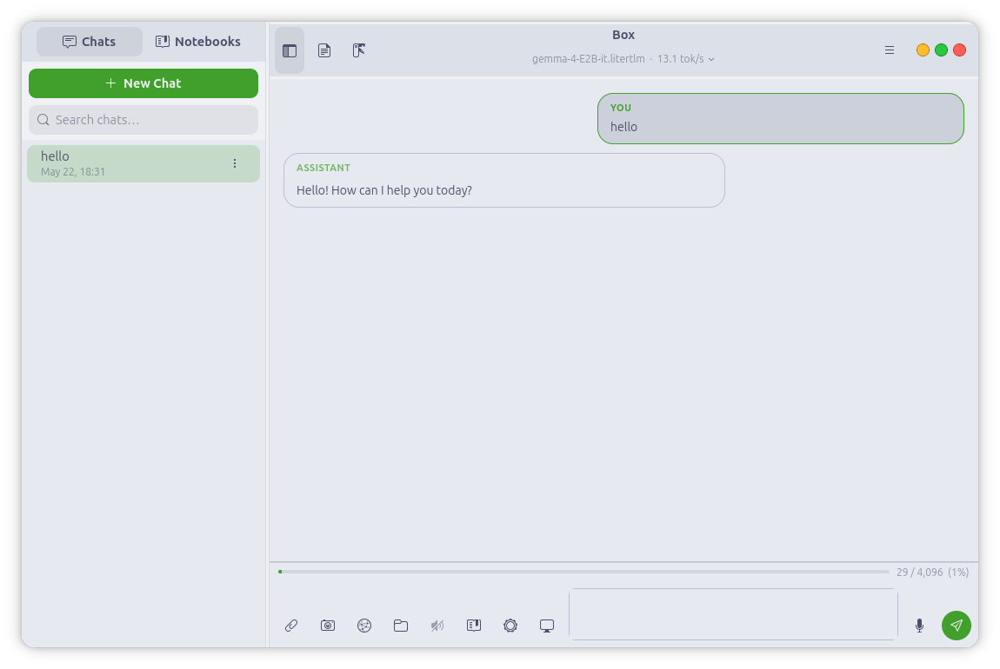<br/><sub>Local Chat</sub></td>
    <td align="center">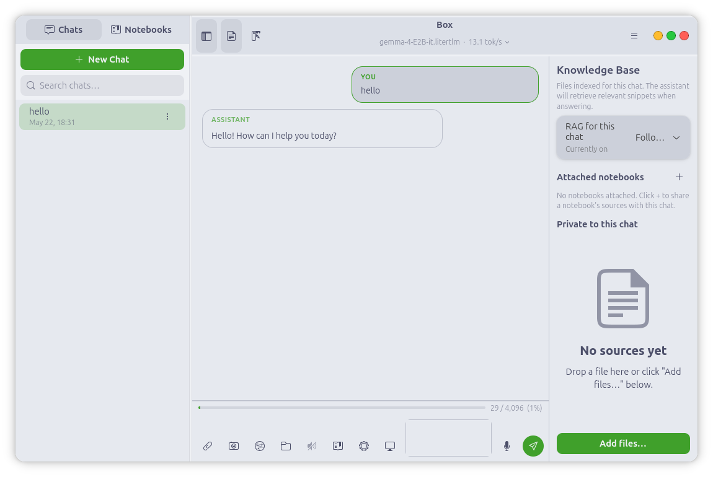<br/><sub>Knowledge Base</sub></td>
    <td align="center">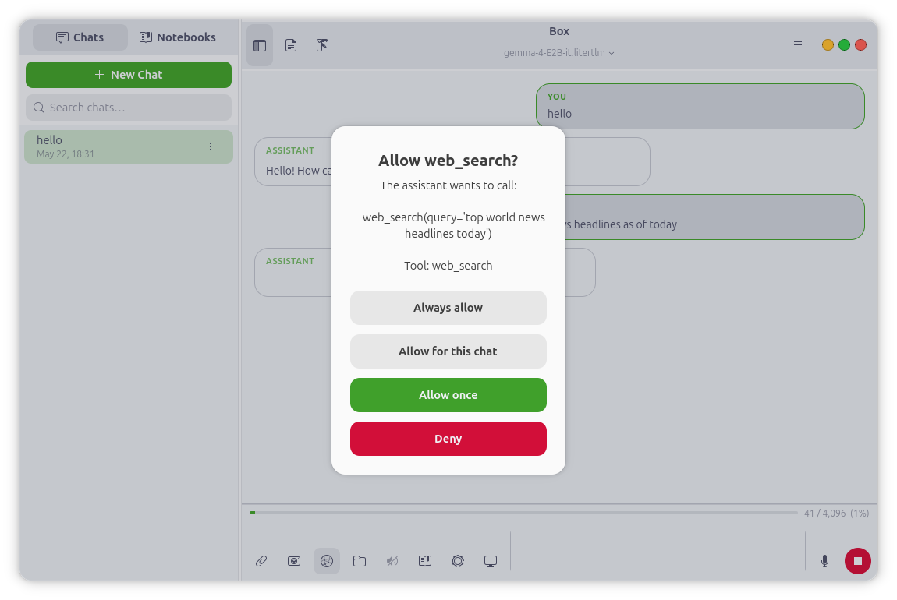<br/><sub>Permission Prompts</sub></td>
  </tr>
  <tr>
    <td align="center">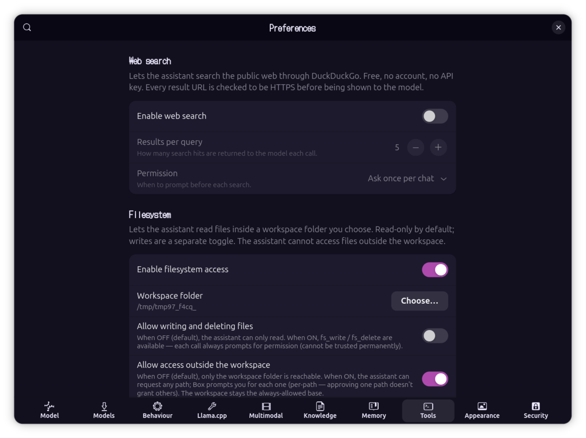<br/><sub>Web &amp; File Tools</sub></td>
    <td align="center">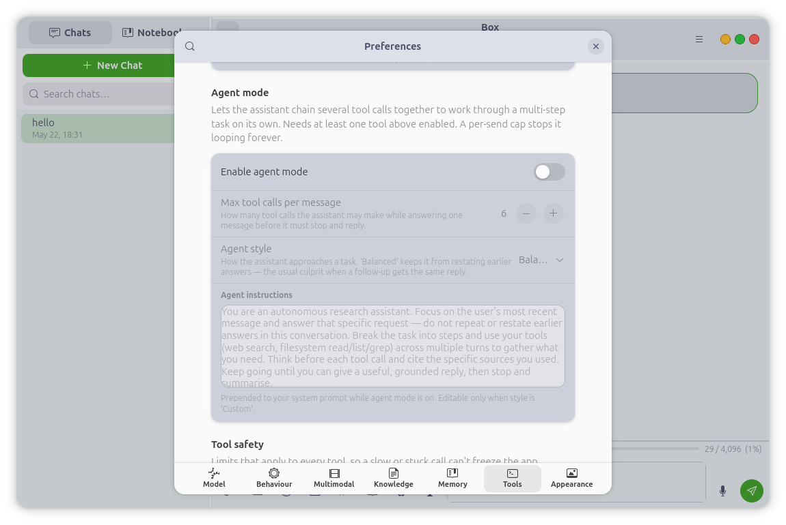<br/><sub>Agent Mode</sub></td>
    <td align="center">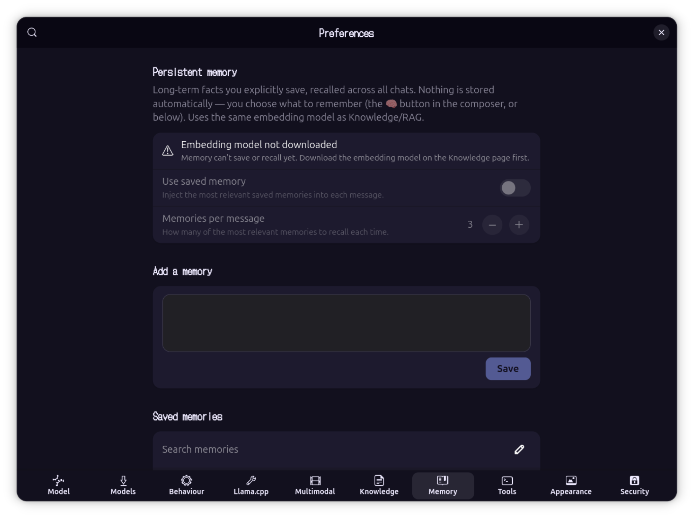<br/><sub>Persistent Memory</sub></td>
  </tr>
  <tr>
    <td align="center">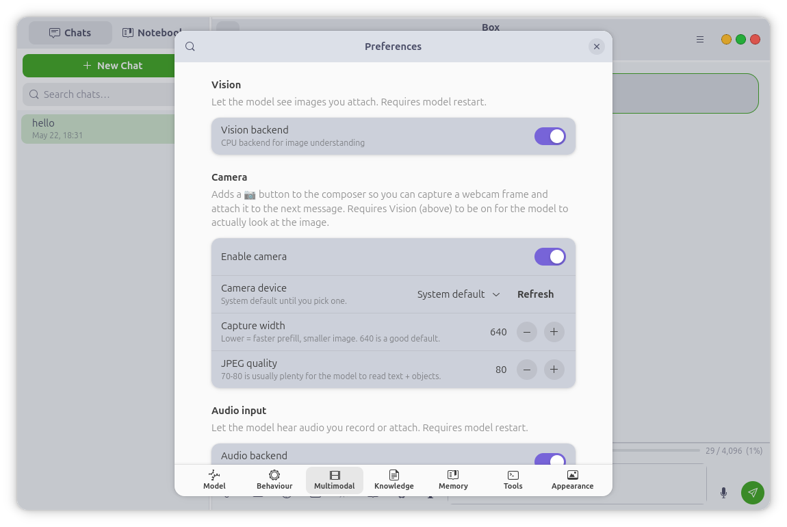<br/><sub>Vision &amp; Camera</sub></td>
    <td align="center">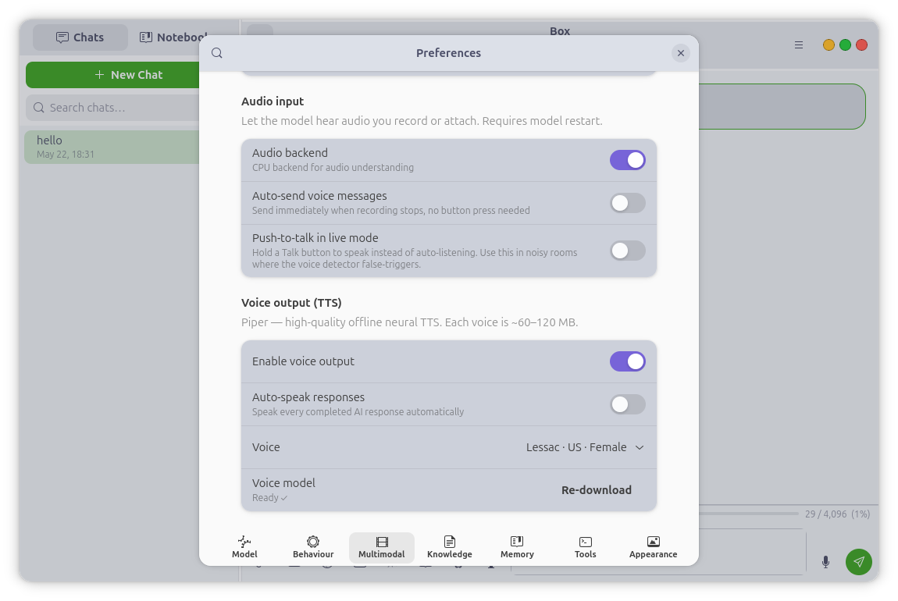<br/><sub>Voice &amp; TTS</sub></td>
    <td align="center">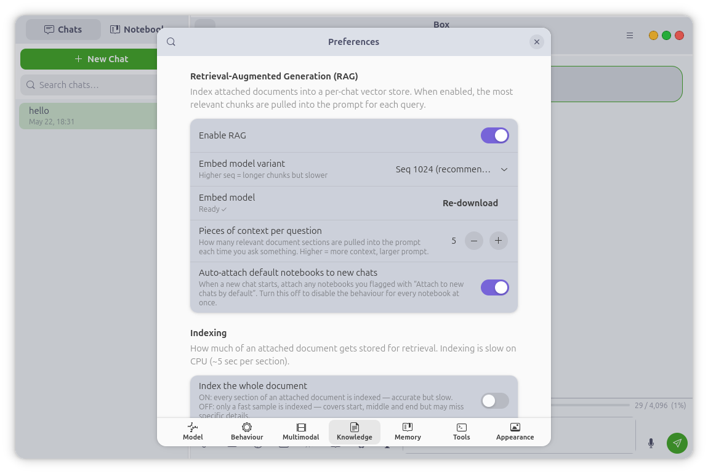<br/><sub>RAG Settings</sub></td>
  </tr>
  <tr>
    <td align="center">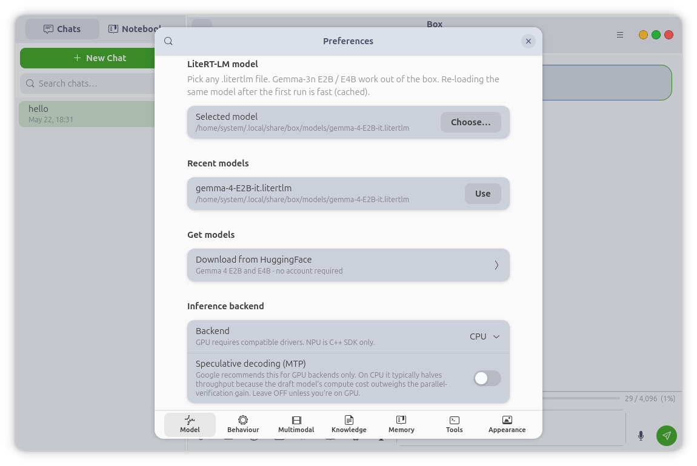<br/><sub>Model Settings</sub></td>
    <td align="center">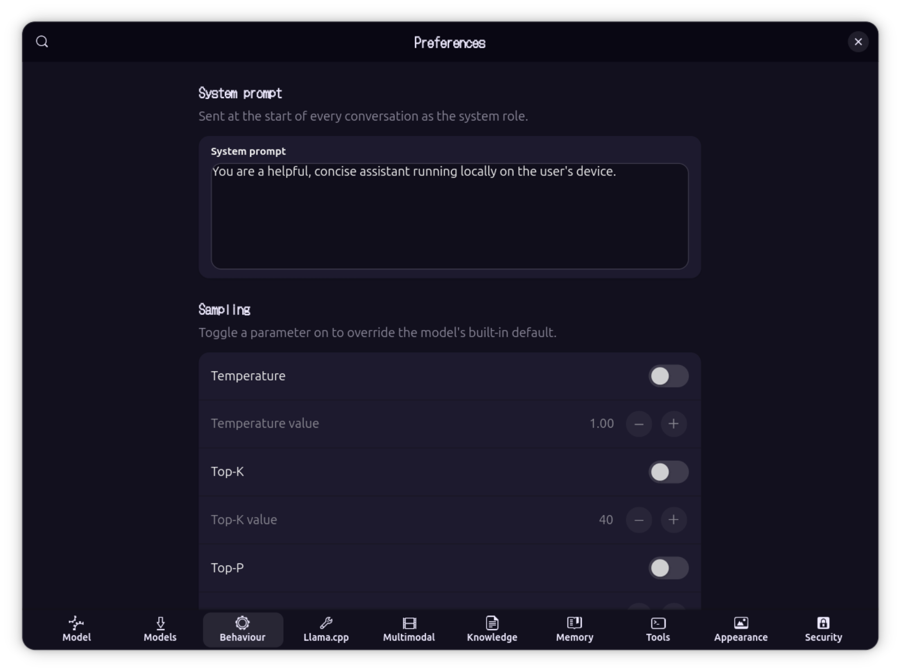<br/><sub>Behaviour</sub></td>
    <td align="center">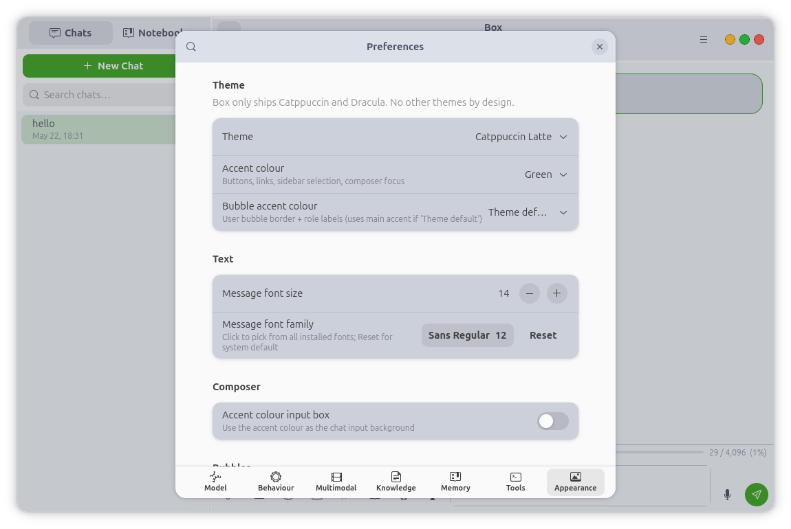<br/><sub>Themes &amp; Appearance</sub></td>
  </tr>
</table>

</div>

---

## Core Features

### Local Chat
Multi-turn conversations with on-device LLMs in `.litertlm` format — Gemma 4 E2B
and E4B are the recommended daily drivers, both supported up to 128K context.
Tokens stream in as they generate, and a snappy Stop button interrupts
mid-token. Full Markdown rendering with LaTeX math — inline expressions render
as Unicode, display equations as images. Attach text, PDF, image, or audio
files directly in the composer. Conversations are saved and resumable, with a
searchable, resizable, hideable sidebar, a live token-usage bar, an adjustable
context window, and a CPU or GPU backend.

### Voice & Conversation
Box listens, thinks, and speaks back. With the audio backend enabled the model
reasons about spoken or attached audio directly — not just transcription.
Record a voice message, play it back inline, and optionally auto-send it. Or
enter **voice conversation mode**: a hands-free, voice-activity-driven loop —
speak, the model replies aloud sentence by sentence as it generates, then it
listens again, no tapping between turns. An optional **push-to-talk** button
covers noisy rooms. Replies are spoken with Piper, an offline neural TTS, in
any of six voices, with adjustable volume.

### Live Camera Vision
Point a webcam at something and ask about it. The 📷 button in the composer
opens a live preview — capture a frame and the model sees it on send.
**Vision Mode** keeps the camera on and auto-captures a frame each turn for a
continuous live-vision conversation. Capture runs through GStreamer + PipeWire
(with a V4L2 fallback), so it integrates cleanly with the Linux camera
permission portal — and the camera light goes off deterministically when you're
done. Images can also be added to your knowledge base, where the model captions
them and makes them searchable.

### Knowledge Base — Document Q&A
Attach a PDF, Markdown file, source file, or plain text and Box chunks, embeds,
and indexes it for retrieval — every answer is grounded in your documents, and
a card on each reply shows exactly which passages the model used.
**Notebooks** are named, reusable collections of documents that live
independently of any chat: index a body of knowledge once and attach it to as
many chats as you like, with an optional auto-attach for collections you always
want. Retrieval unions a chat's private sources with every attached notebook.

### Tools & Agent Mode
Box can search the web (DuckDuckGo, HTTPS-only, no API key, no signup) and read
or write files in a workspace folder you choose. **Agent mode** chains multiple
tool calls to handle multi-step tasks — research and report, compare, plan —
with a configurable per-message cap on tool calls and a live progress pill.
Every tool invocation renders as a collapsible card in the reply, showing the
exact arguments and result.

### Persistent Memory
Save a fact once and Box recalls the relevant ones across all of your chats,
from a long-term store kept separate from per-chat documents. Capture is always
explicit — nothing is remembered without you asking — and a memory inspector
lets you view, search, and delete what Box knows.

### Themes
Six themes — Catppuccin Mocha, Latte, Frappé, and Macchiato, plus Dracula and
Dracula Pro — each with 14 accent colours, five iMessage-style bubble palettes,
a bubble-opacity slider, custom fonts, and macOS-style traffic-light window
controls.

---

> [!NOTE]
> ## You control everything

Every capability in Box for Linux is a separate switch, and **everything is OFF
by default** — vision, audio, TTS, knowledge base, web search, filesystem,
agent mode, and memory are each opt-in.

| Control | What it means |
|---|---|
| Granular toggles | Each capability is its own switch — nothing runs unless you turn it on |
| Permission prompts | Any tool that touches your machine asks first — Allow once / Allow for this chat / Always / Deny |
| Writes always ask | File writes and deletes can never be set to "trust always" — they prompt every time |
| Per-chat overrides | Flip any tool on or off for a single conversation, independent of the global setting |
| HTTPS-only | Every network boundary rejects non-HTTPS URLs — model downloads, web search results, everything |
| Fully on-device | No account, no telemetry, no phoning home; models download once, then run offline |

---

## Install

Download the latest `.deb` from the [Releases](https://github.com/jegly/B0x/releases) page:

```bash
sudo apt install ./box_<version>_amd64.deb
```

The package pulls its system dependencies automatically. Then launch **Box**
from your application menu, or run `box` from a terminal. On first run, Box
offers to download a model (Gemma 4 E2B, ~2.59 GB) — models are downloaded
once and then used entirely offline.

### Requirements

- Ubuntu (amd64) with a GTK4 / libadwaita desktop session
- ~3–4 GB of free storage for a model
- A webcam is optional (live vision mode)
- CPU-only works fine; GPU acceleration is faster but not required. NPU/GPU
  paths are included but not all hardware is tested.

---

## Source & License

The Android app is open source (Apache-2.0). **The Linux desktop app is
distributed as a closed-source binary** — the `.deb` ships compiled code and
its source is not currently published. © Jegly. All rights reserved.

---
