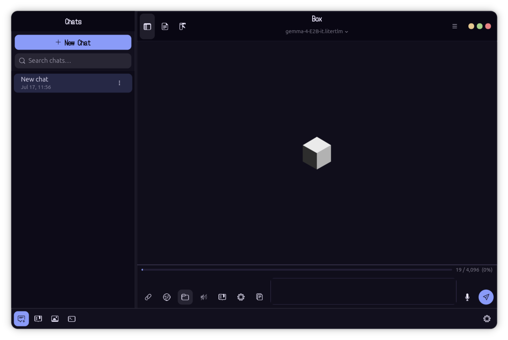
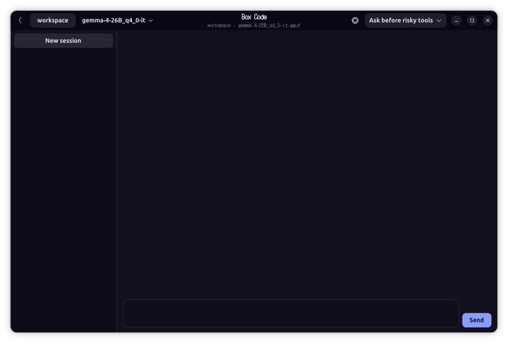
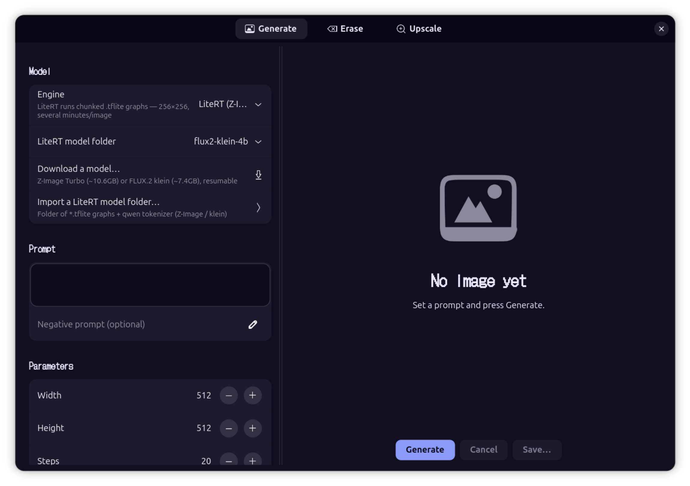
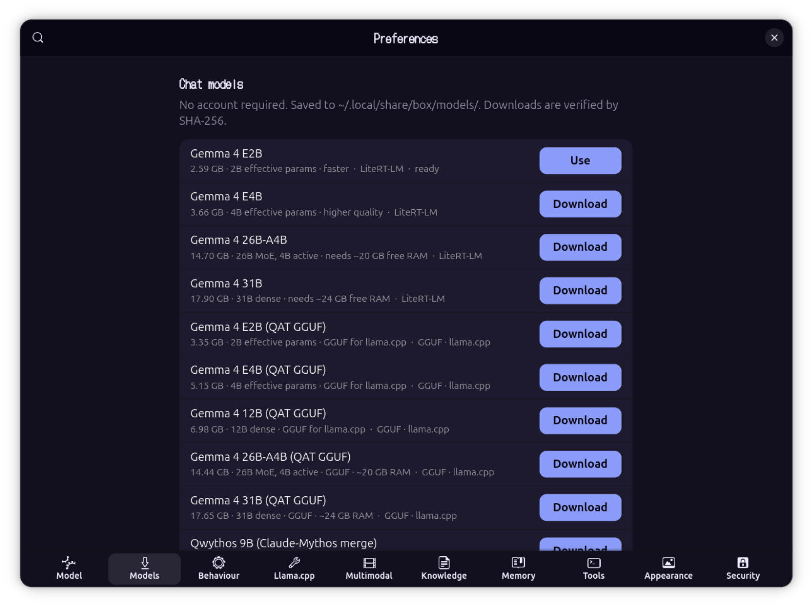
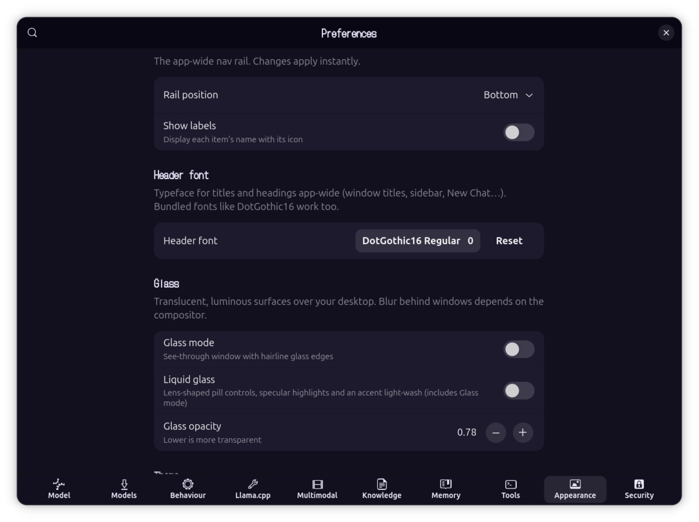
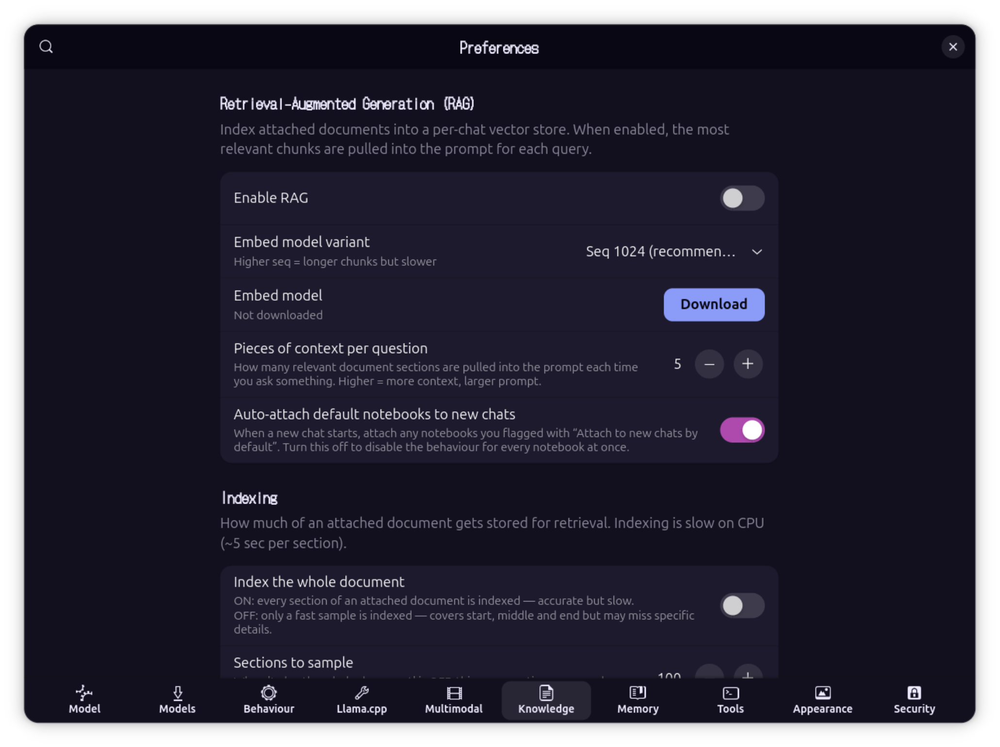
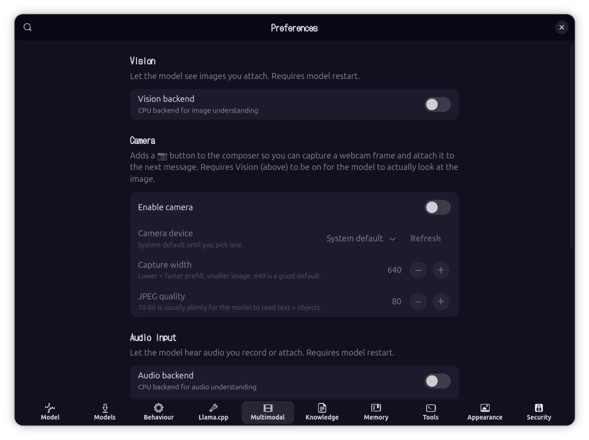
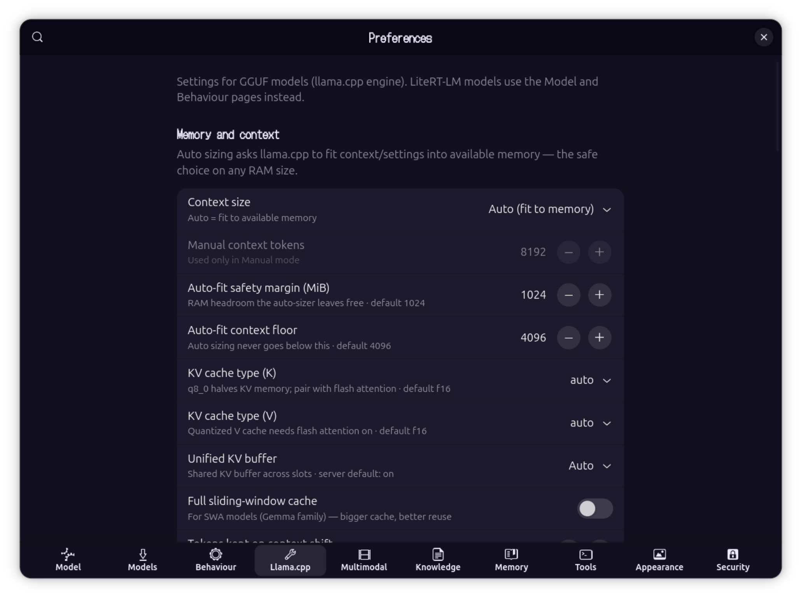
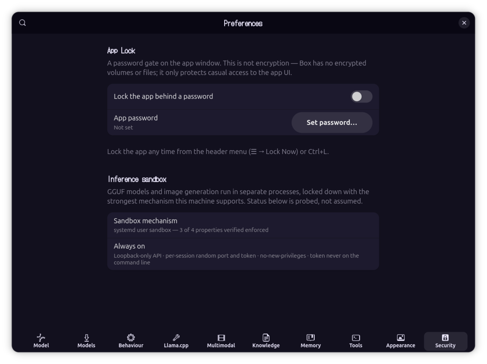

<p align="center">
  
</p>

[]()
[](https://www.python.org)
[](https://www.gtk.org)
[](https://github.com/google-ai-edge/LiteRT-LM)
[](https://github.com/ggml-org/llama.cpp)
[]()
[]()
[]()
[]()
[]()
[]()
[](https://ubuntu.com)
[]()
[]()
[]()

## Box for Linux (Desktop)

**Box for Linux** is a private, on-device **AI workbench** for the Linux
desktop. It chats with text, images, and audio; codes autonomously in its own
agent workspace; generates, inpaints, and upscales images; searches the web;
reads, audits, and edits your files; and answers from your documents — all on
your own machine, with no account and no telemetry. Built on Google's
**LiteRT-LM** runtime as a native GTK4 / libadwaita app, with a bundled
**llama.cpp** engine so GGUF models run side by side with `.litertlm` ones.

> [!IMPORTANT]
> Box for Linux is a **separate application, written from scratch** as its own
> codebase. It is not a port or fork of the Android app. The two share a name
> and a design philosophy and have many of the same features, but they are
> independent projects. The Android app is open source (Apache-2.0). **Box for
> Linux ships as a closed-source binary**: the `.deb` contains compiled code,
> and its source is not published.

## Box for Android

**Box** also runs on Android as a separate, **open-source (Apache-2.0)** app,
with on-device image generation, speech-to-text, encrypted storage with a
biometric lock, and a lot more!

**→ [github.com/jegly/Box](https://github.com/jegly/Box)**

## What is Box for Linux?

Everything runs on your own hardware: the language models, the coding agent,
the diffusion pipelines, the retrieval embedder, the image captioner, and the
text-to-speech. The interface is native GTK, so it starts in under a second,
uses modest memory, and fits your desktop. A nav rail puts every mode one
click away — Chats, Notebooks, Image Studio, and Box Code — and your work
stays on your machine.

---

## Screenshots

<div align="center">

<table>
  <tr>
    <td align="center"><br/><sub>Local Chat &amp; Nav Rail</sub></td>
    <td align="center"><br/><sub>Box Code — Coding Agent</sub></td>
    <td align="center"><br/><sub>Image Studio</sub></td>
  </tr>
  <tr>
    <td align="center"><br/><sub>Model Hub (LiteRT + GGUF)</sub></td>
    <td align="center"><br/><sub>Web &amp; File Tools</sub></td>
    <td align="center"><br/><sub>Glass, Fonts &amp; Nav Rail</sub></td>
  </tr>
  <tr>
    <td align="center"><br/><sub>Knowledge Base &amp; RAG</sub></td>
    <td align="center"><br/><sub>Persistent Memory</sub></td>
    <td align="center"><br/><sub>Vision, Camera &amp; Audio</sub></td>
  </tr>
  <tr>
    <td align="center"><br/><sub>llama.cpp Engine Tuning</sub></td>
    <td align="center"><br/><sub>App Lock &amp; Sandbox</sub></td>
    <td align="center"><br/><sub>System Prompt &amp; Sampling</sub></td>
  </tr>
</table>

</div>

---

## Core Features

### Two Inference Engines
Box is **LiteRT-first**: Gemma `.litertlm` / `.task` models run in-process on
Google's LiteRT-LM runtime with vision, audio, and native tool calling. A
bundled **llama.cpp** engine (CPU and Vulkan builds) runs **GGUF** models
alongside — Gemma QAT, Qwen coders, and anything else in the format — served
by a sandboxed local `llama-server` with tool calling, prefix caching, and
some forty tuning knobs in Preferences. A built-in model hub downloads
checksum-verified chat, image, and coder models in one click, and Box even
self-heals official GGUFs that ship with broken vocabularies (the gemma-4 QAT
duplicate-token assert) at load time.

### Box Code — a Local Coding Agent
A standalone agent workspace in the spirit of Claude Code, running entirely on
your machine with **either engine — LiteRT or GGUF**. Point it at a project
folder and give it tasks: it explores with `glob`/`grep`/`read`, edits with
exact-match patches, runs tests and commands in a **kernel-sandboxed shell**
(writes confined to the project, no network), keeps a todo list, and asks you
when genuinely blocked. Sessions persist and resume; transcripts show every
tool call with syntax-highlighted code. Two permission modes: **Ask** (approve
each risky action, with previews of the exact edit or command) or **Auto**
(walk away — the sandbox still confines it). Type ahead while it works, press
Esc to interrupt, and watch it think ("Herding electrons… 42s · 3 tools").
Optional, off by default: web research through two vetted tools while the
shell stays offline. Project `AGENTS.md` files are honoured automatically.

### Image Studio — Generate, Inpaint, Erase, Upscale
On-device image generation with **two engines**. Google's **LiteRT diffusion
pipelines** run Z-Image Turbo and FLUX.2-klein as chunked `.tflite` graphs.
The bundled **stable-diffusion.cpp** engine runs SD 1.5 / 2.1 checkpoints and
**component bundles — Z-Image Turbo and FLUX.2-klein as GGUFs at any
resolution**, downloaded resumably in one click. The studio does img2img,
**inpainting** with a paintable mask, A1111-style **hires fix**, LoRA with
webui prompt syntax, step caching for real CPU speedups, live previews as the
image resolves, seed reuse, and webui-compatible metadata embedded in every
PNG. An **Erase** tab removes objects with MI-GAN, and **Upscale** does exact
4× with EDSR. GPU users get Vulkan builds with low-VRAM offload switches.

### Tools & Agent Mode (Chat)
Chat-side agent mode chains web search (DuckDuckGo over HTTPS, no API key),
file reading, and grep across a workspace folder to handle multi-step
requests, with a per-message cap and a live progress pill. Every tool call
appears as a collapsible card with its arguments and result. Out-of-workspace
file access is opt-in and prompts per path.

### Local File & Log Audit
Give Box a file — a system log, a config — and ask for an audit. It
map-reduces files larger than the context window into a single report with
live progress, on either engine.

### Knowledge Base: Document Q&A
Attach PDFs, Markdown, source files, or plain text and Box indexes them for
retrieval; answers cite the passages used. **Notebooks** are reusable document
collections that attach to any chat, with optional auto-attach.

### Local Chat
Multi-turn conversations with streaming tokens, Markdown and LaTeX rendering,
**syntax-highlighted code blocks**, and attachments (text, PDF, image, audio).
Gemma 4 E2B/E4B are the recommended daily drivers with up to 128K context.
Conversations save and resume; the sidebar is searchable; a bar tracks context
usage.

### Voice, Vision & Memory
Hands-free **voice conversation mode** with sentence-by-sentence TTS (Piper,
six voices), push-to-talk, and audio-aware models. **Live camera vision**
through GStreamer/PipeWire captures a frame per turn. **Persistent memory**
recalls facts you explicitly save, with an inspector to review and delete.

### Themes & Glass
**52 themes** — Catppuccin, Dracula, 44 Ptyxis terminal palettes, and two
built for translucency: **Glass** and **Liquid Glass**. Flip on **Glass
mode** for a see-through window with luminous hairline edges, or **Liquid
Glass** for pill controls, specular highlights, and an accent light-wash —
each works with any theme, with an opacity dial. Fourteen accent colours,
bubble palettes and opacity, custom chat and **header fonts** (80 bundled,
DotGothic16 included), pastel traffic-light window controls, and a
repositionable nav rail (left/right/top/bottom, labels optional).

### Security & Privacy by Architecture
Model servers and image generators run **kernel-sandboxed** (Landlock LSM
where available, systemd hardening otherwise, honestly reported in-app):
read-only on their own files, one localhost port, **no outbound network**.
The Box Code shell gets the same treatment. **App Lock** gates the whole app
— every window — behind an Argon2id passphrase, with close-to-tray locking.
HTTPS-only networking, checksum-verified downloads, no account, no telemetry.

---

> [!NOTE]
> ## You decide what runs

Each capability in Box for Linux is its own switch, and they all start off.
Vision, audio, TTS, the knowledge base, web search, the filesystem, agent
mode, Box Code's web research, and memory are opt-in.

| Control | What it means |
|---|---|
| Granular toggles | Each capability is its own switch. It runs only after you turn it on |
| Permission prompts | Any tool that touches your machine asks first: Allow once, for this chat, always, or deny |
| Writes always ask | File writes and deletes prompt every time; you cannot set them to trust-always |
| Workspace by default | File access stays inside a folder you choose; Box Code is hard-scoped to its project folder |
| Kernel sandboxing | Inference servers and the agent shell run confined — no network, no stray writes — and the app reports what's actually enforced |
| Per-chat overrides | Turn any tool on or off for a single conversation, apart from the global setting |
| HTTPS-only | Every network request must use HTTPS; Box rejects plain HTTP for model downloads and search results |
| Fully on-device | No account and no telemetry. Models download once, then run offline |

---

## Install

Download the latest `.deb` (currently `box_0.4.0_amd64.deb`) from the
[Releases](https://github.com/jegly/B0x/releases) page:

```bash
sudo apt install ./box_0.4.0_amd64.deb
```

The package pulls its system dependencies automatically. Launch **Box** from
your application menu, or run `box` in a terminal. On first run, Box offers to
download a model (Gemma 4 E2B, ~2.59 GB). After that, it runs offline.

### Requirements

- Ubuntu (amd64) with a GTK4 / libadwaita desktop session
- 3–4 GB of free storage for a chat model; 5–10 GB more if you want the
  image-generation bundles
- A webcam is optional, for live vision mode
- CPU-only works fine; GPU acceleration (Vulkan) is faster but not required.
  NPU and GPU paths are included, though not all hardware is tested.

---

## Source & License

The Android app is open source (Apache-2.0). The Linux desktop app ships as a
closed-source binary: the `.deb` contains compiled code, and its source is not
published. © Jegly. All rights reserved.

---
